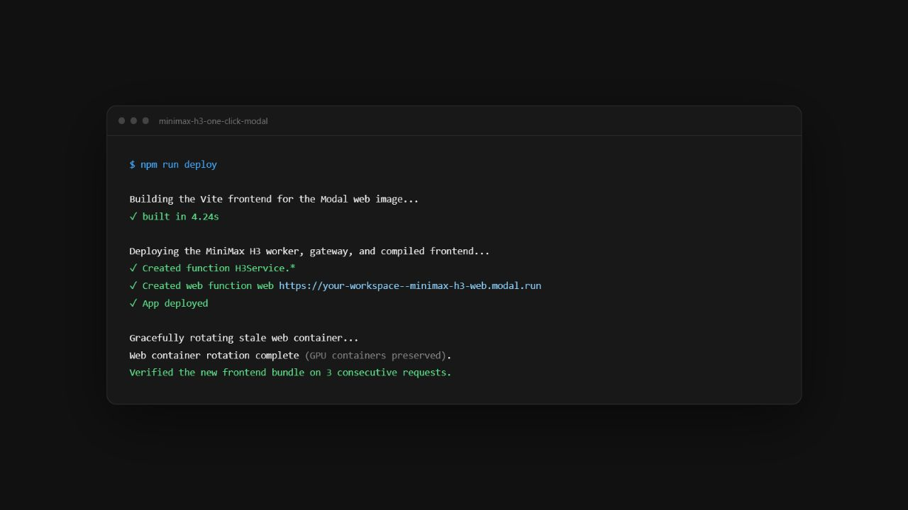
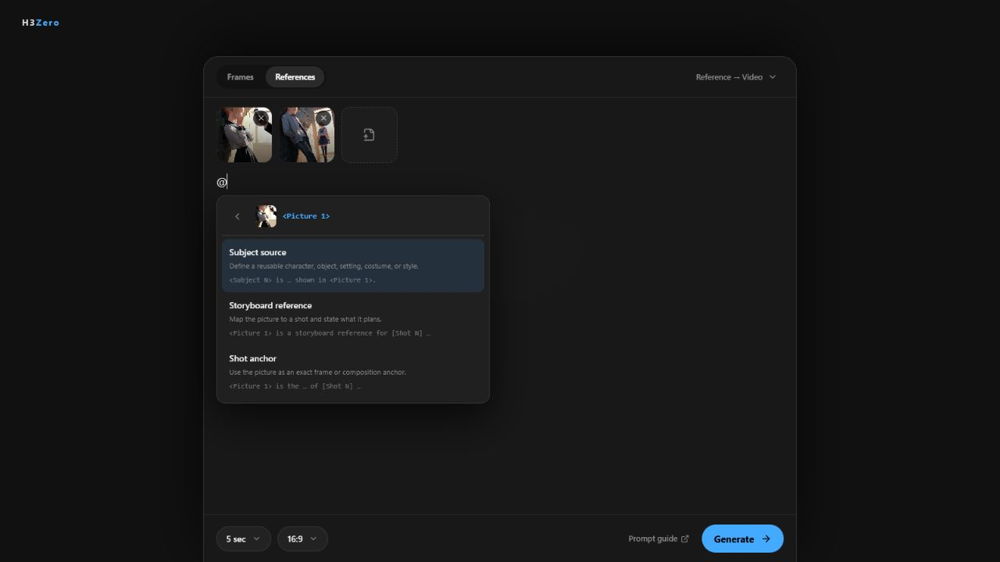
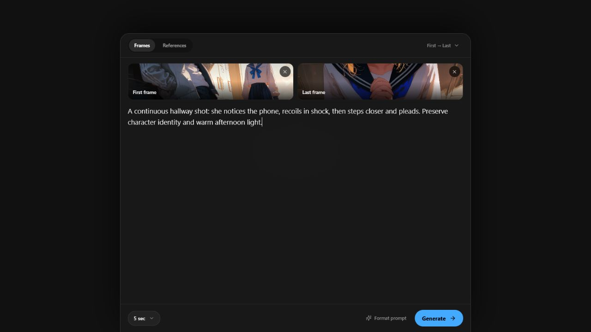

# H3Zero

## Turn Modal's free $30 monthly credit into 21 minutes of MiniMax H3 video.

**Ten-second videos in about three minutes. About 23¢ each. Zero idle GPU
spend.**

One command · Zero ComfyUI wiring · Zero ML experience · Zero pods to stop

864×480 landscape · 480×864 portrait · Desktop and mobile

<details>
<summary><strong>How the estimate works</strong></summary>

<br>

Modal Starter currently includes
[$30/month in compute credits](https://modal.com/pricing). An observed
ten-second generation took 192 seconds. At Modal's current listed rates for one
RTX PRO 6000, 16 CPU cores, and 64 GiB memory, that is $0.2292:

- $30 ÷ $0.2292 = about 130 videos
- 130 × 10 seconds = about 21 minutes 40 seconds

The GPU scales to zero after ten idle seconds. Assumes the full credit is
available; actual cost varies. Modal requires a payment method.

</details>

## Setup

**Requires:** [Modal account](https://modal.com/docs/guide/modal-user-account-setup)
· Node.js 20+ · Python 3.11+ · Git

```bash
git clone https://github.com/hui-tony-zk/h3zero.git
cd h3zero
npm run setup
```

When setup finishes, open the printed URL:

```text
web => https://your-workspace--minimax-h3-web.modal.run
```

> **First setup is not one minute:** about 94 GiB of weights plus the GPU image
> build. Interrupted? Run `npm run setup` again; completed downloads are reused.

> **Public endpoint:** anyone with the URL can start paid GPU work.

<details>
<summary><strong>Setup details</strong></summary>

<br>

- Python environment + pinned tooling
- Modal browser authentication
- Public model weights → Modal Volume
- Frontend install + build
- Separate GPU-worker and public-web deployments + frontend verification

**Zero manual setup for:** npm packages · virtualenv · Hugging Face account/token
· copied API keys



- **Open it:** H3Zero
- **Bookmark it:** no `.env` required
- **Use `<url>/api/...`:** browser API
- **Access:** public and unauthenticated

</details>

After setup, `npm run deploy` rebuilds and deploys only the gateway/frontend.
It leaves the GPU worker and its CPU memory snapshots untouched. Run
`npm run deploy:gpu` only after intentional worker, runtime, or workflow changes.

<details>
<summary><strong>Let a coding agent set it up</strong></summary>

<br>

Paste this request into your coding agent:

> Read `README.md`, `AGENTS.md`, and `MODEL_NOTICE.md`. Check for Node.js 20+,
> Python 3.11+, and Git, then run `npm run setup`. Pause if Modal opens browser
> authentication so I can complete it. Never request, print, or store my Modal
> credentials. Do not add a Hugging Face token. Return the `web =>` URL and
> verify `/api/health`. Do not start a paid GPU generation unless I ask.

</details>

<details>
<summary><strong>Generate from the terminal</strong></summary>

<br>

```bash
npm run generate -- --prompt "A lighthouse in a night storm. Audio: waves and thunder." --out outputs/lighthouse.mp4
```

**Default:** five seconds · 864×480 · no deployed URL configuration required

</details>

## Features

### Mix images, video, and audio

- Ordered multimodal references
- Automatic `<Picture 1>`, `<Video 1>`, and `<Audio 1>` prompt tags
- Visible “Insert as…” recipes for subjects, storyboards, and shot anchors
- Hover or tap prompt sections for guidance and examples
- Identity, appearance, motion, and style in one rich prompt
- [Official MiniMax H3 full-reference prompting guide](https://huggingface.co/MiniMaxAI/MiniMax-H3/blob/main/docs/VIDEO_PROMPT_WRITING_GUIDE_ref_en.md)
- Desktop and mobile—from anywhere




### Direct shots with keyframes

- Text only, first frame, last frame, or both
- First uploaded frame sets the composition
- Built-in crop fixes mismatched geometry before GPU work
- [Official MiniMax H3 base prompting guide](https://huggingface.co/MiniMaxAI/MiniMax-H3/blob/main/docs/VIDEO_PROMPT_WRITING_GUIDE_base_en.md)



### Eight-step Turbo sampling

Turbo cuts a 15-second, 480p generation to about 1.5 minutes on the current
RTX PRO 6000 deployment after the worker is warm. Cold starts and model loading
add time, and actual speed varies with Modal capacity.

- Both frame and reference workflows use the
  [MiniMax-H3 Turbo LoRA](https://huggingface.co/larryvrh/MiniMax-H3-Turbo-Lora)
- Eight sampling steps by default, within the recommended 4–8 step range
- Current v4-600 EMA checkpoint and companion ComfyUI nodes pinned together
- Version-adaptive sampling for ComfyUI's native video/audio sigma handling

The Turbo release is a preview. Its author notes that audio and fast, intense
motion are still being improved; H3Zero uses the recommended strength of `1.0`.

### Jobs survive the browser

- Durable, asynchronous jobs
- Queue → loading → sampling → decoding → complete
- Visible progress; results persist until deleted
- Modal cloud-synced favorites, including saved source inputs for cross-device remixing


### Automate through the API

- Same public URL as H3Zero
- Submit, poll, download, cancel, and delete jobs
- Zero second service or separate API deployment

HTTP routes and curl examples: [browser API guide](docs/api.md).

## Before you deploy

- First generation may be slower while H3 loads
- Endpoint is public and unauthenticated
- Model terms differ from this repository's Apache-2.0 license
- Confirm your location, infrastructure, users, and use case comply with the
  [MiniMax H3 model notice](MODEL_NOTICE.md)

## License

- Repository code: [Apache-2.0](LICENSE)
- Model: [MiniMax H3 Community License notice](MODEL_NOTICE.md)
