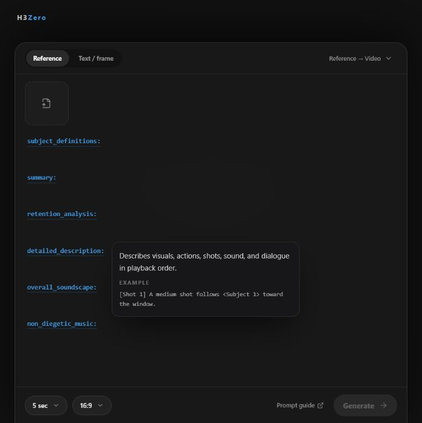
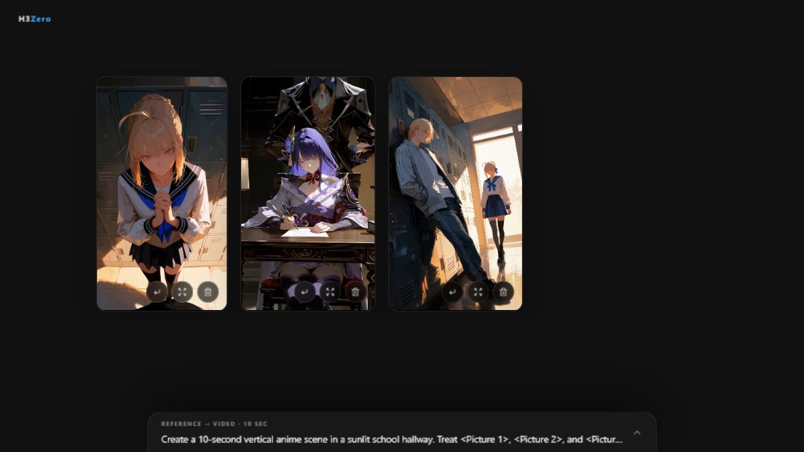

# H3Zero

## Generate 15 seconds of MiniMax H3 video in about 50 seconds.

[LightX2V four-step Turbo](https://huggingface.co/lightx2v/Minimax-h3-Turbo)
on Modal—with native audio, multimodal references, and quality-mode alternatives.

**Measured at 480p on a warm RTX PRO 6000.**

One-command deployment · Local-first results · Cloud-synced favorites

480p output · Landscape and portrait · Desktop and mobile

## Get started

**Requires:** [Modal account](https://modal.com/docs/guide/modal-user-account-setup)
· Node.js 20+ · Python 3.11+ · Git

```bash
git clone https://github.com/hui-tony-zk/h3zero.git
cd h3zero
npm run setup
```

Open the URL printed after deployment:

```text
web => https://your-workspace--minimax-h3-web.modal.run
```

> Initial setup downloads about 98 GiB of model weights, plus any custom LoRAs,
> and builds the GPU image. Completed downloads are reused if setup is interrupted.

> The deployed endpoint is public and unauthenticated. Anyone with its URL can
> start paid GPU work.

## Sampling profiles

The composer offers one sampling-profile dropdown for both frame and reference
generation: the four-step and eight-step
[LightX2V MiniMax-H3 Turbo LoRAs](https://huggingface.co/lightx2v/Minimax-h3-Turbo),
[Spectrum](https://github.com/xmarre/ComfyUI-Spectrum-MiniMax-H3) at 30 steps,
and the original Base workflow at 30 steps. All four options generate at 480p
with a random seed; resolution and seed controls are intentionally omitted.
Every profile uses Comfy Kitchen INT8 attention globally. An optional Sparse
attention control offers 30%, 15%, and 10% target-video attention retention
with a denser early ramp; it is off by default because it can change prompt
adherence, motion, and detail. Spectrum remains an additional
transformer-forecasting layer only for the Spectrum profile.

Turbo is a preview. Cold starts and model loading add time, and actual speed
varies with Modal capacity.

## Add your own LoRAs

Create the gitignored file `minimax_h3/local_loras.py` and add each LoRA as a
display name plus a direct public Hugging Face download URL:

```python
LORAS = {
    "My Style": "https://huggingface.co/creator/model-repo/resolve/COMMIT_SHA/my-style.safetensors",
    "My Linked Style": {
        "download_url": "https://huggingface.co/creator/model-repo/resolve/COMMIT_SHA/linked-style.safetensors",
        "reference_url": "https://example.com/linked-style",
    },
}
```

Then download the weights and update both deployments:

```bash
npm run models
npm run deploy:gpu
npm run deploy
```

Configured LoRAs appear automatically in the composer mixer with a `0.0–1.5`
strength control and are off by default. An optional `reference_url` makes the
LoRA name an external link in Add mode. Use a commit SHA in the download URL to
pin the file. No Hugging Face token is used, so it must be publicly downloadable.
The local catalog is not committed and each deployment keeps its own selection.

## Create with frames or references

- Generate from text, a first frame, a last frame, or both
- Mix ordered images, videos, and audio in one prompt
- Run reference conditioning through the higher-quality FL2VA checkpoint; the
  Ref2VA checkpoint remains downloaded as a fallback for future comparisons
- Insert automatic `<Picture 1>`, `<Video 1>`, and `<Audio 1>` references
- Use built-in prompt recipes and crop mismatched keyframes before GPU work
- Follow the official [base](https://huggingface.co/MiniMaxAI/MiniMax-H3/blob/main/docs/VIDEO_PROMPT_WRITING_GUIDE_base_en.md)
  and [full-reference](https://huggingface.co/MiniMaxAI/MiniMax-H3/blob/main/docs/VIDEO_PROMPT_WRITING_GUIDE_ref_en.md)
  prompting guides



## Generate and remix

- Launch one to three variations together
- Track durable jobs from queue through loading, sampling, and decoding
- Cache completed videos in local browser storage
- Keep favorite videos and remix sources durably in Modal
- Arrange device-cached results in local-only projects with drag-to-reorder, trimming, speed controls, optional 0.3-second fade-through-black transitions, sequential preview, and MP4 export



## Sync favorites across devices

Choose a Modal cloud-sync name, then use the same name in another browser to
open the same favorite videos and restore their source inputs for remixing.
Favorites retain their own MP4 and optional reference assets after temporary
job storage is cleaned up.

Sync names separate collections but are not passwords. Anyone who knows the
deployment URL and sync name can open that collection.

## Use the API

The same public URL serves H3Zero and its browser API. Submit, poll, download,
cancel, and delete jobs without a second service. Send `sampling_profile` as
`turbo_4`, `turbo_8`, `spectrum`, or `base`; omitted values default to
`turbo_4`.

See the [browser API guide](docs/api.md) for routes and curl examples.

## Commands

| Command | Purpose |
| --- | --- |
| `npm run setup` | Install, download models, build, and deploy everything |
| `npm run deploy` | Deploy only the gateway and frontend |
| `npm run deploy:gpu` | Deploy intentional GPU worker or workflow changes |
| `npm run maintenance` | Migrate favorites and prune expired temporary jobs |
| `npm run generate -- ...` | Generate from the terminal |
| `npm run frontend:dev` | Run the frontend locally |
| `npm test` | Run all no-GPU checks |

Web-only deployment preserves the GPU worker and its CPU memory snapshots. Local
frontend development uses `H3_MODAL_URL` in the root `.env`; deployed H3Zero
uses same-origin `/api` routes and needs no configured base URL.

## Before you deploy

- The first generation may be slower while H3 loads
- The GPU scales to zero after thirty idle seconds
- The endpoint is public and unauthenticated
- Model terms differ from this repository's Apache-2.0 license
- Confirm your location, infrastructure, users, and use case comply with the
  [MiniMax H3 model notice](MODEL_NOTICE.md)

## License

- Repository code: [Apache-2.0](LICENSE)
- Model: [MiniMax H3 Community License notice](MODEL_NOTICE.md)
